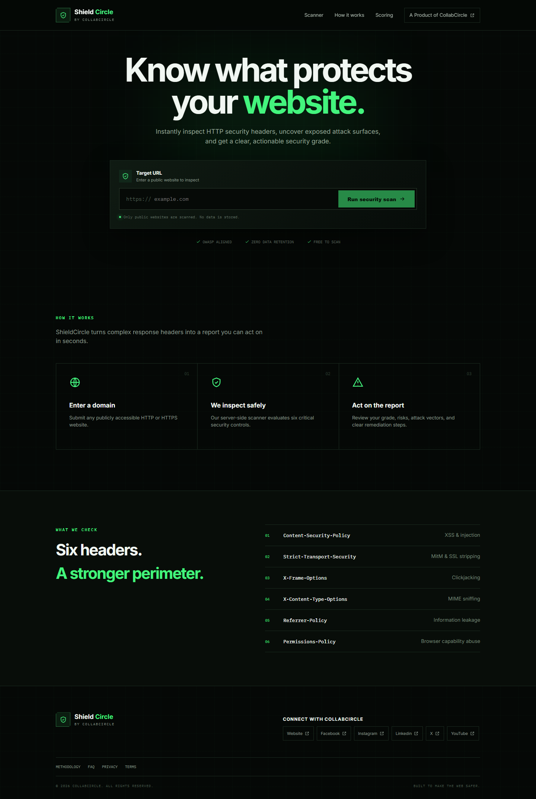
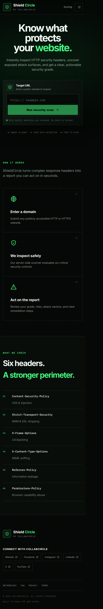
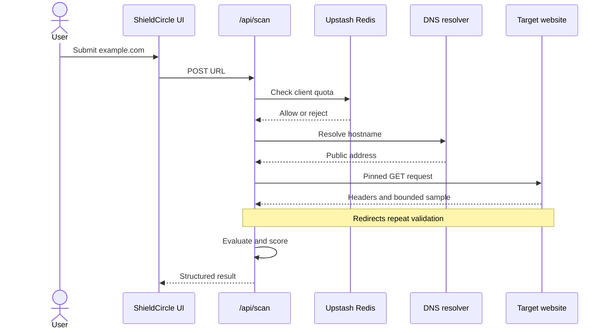

# ShieldCircle

> Know what protects your website.

[ShieldCircle](https://shieldcircle.vercel.app) is a lightweight, browser-based HTTP Security Header & Threat Scanner built by **CollabCircle**. It inspects a public website's response, evaluates important browser security controls, and presents a 0-100 score, an A+ through F grade, evidence, and remediation guidance.

**Live application:** [https://shieldcircle.vercel.app](https://shieldcircle.vercel.app)

ShieldCircle uses a Next.js server route to scan outside the browser, avoiding browser CORS restrictions. It requires neither user accounts nor a scan-history database.

## Important scope

ShieldCircle reports signals observed in one HTTP response. It does **not** prove that a website is secure, confirm exploitability, certify compliance, or replace a penetration test. Results can vary by path, geographic edge, authentication state, cookies, user agent, and deployment. Only scan systems you own or are authorized to assess.

## UI snapshots

| Desktop | Mobile |
| --- | --- |
|  |  |

## Features

- Public HTTP/HTTPS scanning through a Next.js serverless route
- Six weighted, OWASP-aligned security-header checks
- Context-aware CSP Level 3 analysis for nonces, hashes, `strict-dynamic`, Trusted Types, reporting, and multiple policies
- Evidence, confidence, severity, attack-vector, and remediation details
- Redirect-chain visibility with validation at every hop
- Supplemental TLS, cookie, HTTPS, CORS, cross-origin isolation, mixed-content, and technology-disclosure observations
- JSON export, clipboard summary, printing, and local report comparison
- Responsive black-and-green interface with accessible interaction and reduced-motion support
- Distributed Upstash Redis rate limiting and deployment health monitoring
- Privacy-conscious structured logs with request IDs and hashed target identifiers
- Nonce-based CSP and hardened application response headers
- Automated unit, integration, browser, mobile, and accessibility tests
- GitHub Actions quality gates and Dependabot updates

## Scoring methodology

| Control | Weight | Main risk addressed | Strong configuration |
| --- | ---: | --- | --- |
| `Content-Security-Policy` | 30 | XSS and content injection | Nonce/hash-based strict CSP with defense-in-depth directives |
| `Strict-Transport-Security` | 20 | MitM interception and SSL stripping | At least one year of `max-age` |
| Frame protection | 15 | Clickjacking | CSP `frame-ancestors`, with XFO recognized for legacy compatibility |
| `X-Content-Type-Options` | 15 | MIME confusion | `nosniff` |
| `Referrer-Policy` | 10 | URL and browsing-context leakage | Explicit privacy-preserving policy |
| `Permissions-Policy` | 10 | Unnecessary browser capabilities | Sensitive capabilities explicitly restricted |

Passing controls receive full credit. Partially effective configurations receive rule-specific partial credit. A missing optional control may receive limited fallback credit where modern browsers provide a meaningful default.

| Score | Grade |
| ---: | :---: |
| 95-100 | A+ |
| 85-94 | A |
| 75-84 | B |
| 65-74 | C |
| 50-64 | D |
| 0-49 | F |

The methodology version is included in every report. A warning means a defense is absent or weaker than the benchmark; it is not proof of an active vulnerability. See the live [methodology page](https://shieldcircle.vercel.app/methodology).

## System flow

```mermaid
flowchart LR
    U[User enters a public URL] --> C[Client validates input]
    C -->|POST /api/scan| A[Next.js API route]
    A --> L[Apply distributed rate limit]
    L --> N[Normalize and validate URL]
    N --> D[Resolve DNS and reject unsafe IPs]
    D --> P[Pin connection to validated address]
    P --> F[Fetch with timeout and manual redirects]
    F -->|Redirect| N
    F --> H[Evaluate headers and observations]
    H --> S[Calculate score and grade]
    S -->|Structured JSON| R[Interactive report]
```





## Architecture

```text
ShieldCircle/
|-- app/
|   |-- api/health/route.ts       # Readiness endpoint
|   |-- api/scan/route.ts         # Rate-limited scan endpoint
|   |-- faq/                      # FAQ page
|   |-- methodology/              # Scoring documentation
|   |-- privacy/                  # Privacy page
|   |-- terms/                    # Responsible-use terms
|   |-- global-error.tsx
|   |-- layout.tsx
|   |-- page.tsx
|   |-- robots.ts
|   `-- sitemap.ts
|-- components/                   # Modular interface components
|-- lib/
|   |-- scanner/
|   |   |-- csp.ts                # CSP parser and analysis
|   |   |-- observations.ts       # Non-scored signals
|   |   |-- rules.ts              # Weighted header rules
|   |   |-- scan.ts               # Safe fetch orchestration
|   |   |-- score.ts              # Score and grade calculation
|   |   |-- tls.ts                # TLS inspection
|   |   |-- types.ts              # Shared contracts
|   |   `-- url-security.ts       # URL, DNS, and SSRF checks
|   |-- concurrency.ts
|   |-- logging.ts
|   |-- rate-limit.ts
|   |-- request-body.ts
|   |-- site.ts
|   `-- socials.ts
|-- public/screenshots/
|-- tests/e2e/
|-- proxy.ts                      # Per-request nonce CSP
|-- next.config.ts                # Security headers
|-- playwright.config.ts
|-- vercel.json
`-- vitest.config.ts
```

The unified App Router project separates UI, API orchestration, evaluation, transport safeguards, and shared contracts into focused modules.

## Technology

- Next.js 16 App Router, React 19, and TypeScript
- Upstash Redis and `@upstash/ratelimit`
- Undici for controlled outbound requests
- Vitest, Playwright, and Axe
- Vercel production hosting

## Local setup

Requirements: Node.js 20.9 or newer, npm, and internet access for installation and target scans.

```bash
git clone <repository-url> ShieldCircle
cd ShieldCircle
npm install
cp .env.example .env
npm run dev
```

PowerShell equivalent for the environment file:

```powershell
Copy-Item .env.example .env
```

Open [http://localhost:3000](http://localhost:3000). Development uses an in-memory rate limiter if Upstash is absent. Production fails closed unless distributed limiting is configured.

## Environment variables

Names are case-sensitive. Social links are read server-side, accepted only as HTTPS URLs, and omitted when invalid or empty.

| Variable | Production | Purpose | Example |
| --- | :---: | --- | --- |
| `Website` | Optional | CollabCircle website | `https://collabcircle.example` |
| `Facebook` | Optional | Facebook page | `https://facebook.com/collabcircle` |
| `Instagram` | Optional | Instagram profile | `https://instagram.com/collabcircle` |
| `Linkedin` | Optional | LinkedIn company page | `https://linkedin.com/company/collabcircle` |
| `X` | Optional | X profile | `https://x.com/collabcircle` |
| `YouTube` | Optional | YouTube channel | `https://youtube.com/@collabcircle` |
| `SITE_URL` | Required | Canonical origin for metadata, sitemap, and robots | `https://shieldcircle.vercel.app` |
| `UPSTASH_REDIS_REST_URL` | Required | Shared Redis REST endpoint | Supplied by Upstash |
| `UPSTASH_REDIS_REST_TOKEN` | Required | Secret Redis REST credential | Supplied by Upstash |
| `TRUSTED_IP_HEADER` | Platform-specific | Trusted proxy's client-IP header | Leave unset on Vercel |
| `ALLOW_IN_MEMORY_RATE_LIMIT` | No | Local production-like override | `false` |

Never expose or commit the Upstash token. `.env` is ignored by Git; `.env.example` contains safe placeholders.

### Vercel configuration

Add values under **Project Settings -> Environment Variables**, then redeploy:

```env
SITE_URL=https://shieldcircle.vercel.app
UPSTASH_REDIS_REST_URL=<Upstash REST URL>
UPSTASH_REDIS_REST_TOKEN=<Upstash REST token>
ALLOW_IN_MEMORY_RATE_LIMIT=false
```

Leave `TRUSTED_IP_HEADER` unset on Vercel; ShieldCircle detects Vercel automatically. Apply required values to Production and, if scanning should work in preview deployments, Preview.

## API

### `POST /api/scan`

```json
{ "url": "example.com" }
```

Successful output includes requested/final URLs, HTTP status, timing, redirect chain, TLS metadata, score, grade, findings, observations, and methodology version. The production route permits ten scans per client per minute with an Upstash sliding window. It may return `400`, `413`, `429`, `503`, or `504`; responses are not cached.

Relevant response headers include `X-Request-Id`, `X-RateLimit-Remaining`, and `Retry-After`.

### `GET /api/health`

[https://shieldcircle.vercel.app/api/health](https://shieldcircle.vercel.app/api/health)

Healthy production response:

```json
{
  "status": "ok",
  "service": "shieldcircle",
  "version": "unknown",
  "distributedRateLimit": true
}
```

A production deployment without distributed rate limiting reports `misconfigured` with HTTP `503`.

## Security model

Fetching user-controlled URLs creates SSRF risk. ShieldCircle reduces it by:

1. Accepting only HTTP/HTTPS without credentials or custom ports.
2. Resolving hostnames before connecting.
3. Rejecting local, private, link-local, multicast, reserved, and unsafe address ranges.
4. Pinning connections to validated addresses while retaining TLS hostname verification.
5. Handling redirects manually and repeating checks at every hop.
6. Limiting scans to five redirects and a ten-second target timeout.
7. Limiting request bodies and sampling at most 512 KiB of eligible HTML.
8. Returning findings instead of target response bodies.
9. Limiting concurrent scans per application instance.
10. Applying distributed per-client rate limiting in production.

The app also sends a nonce CSP, HSTS, frame and MIME protection, Referrer Policy, Permissions Policy, COOP, and CORP. Application safeguards do not replace managed bot protection, monitoring, or provider-level egress controls.

## Privacy

ShieldCircle has no accounts or scan-history database and does not intentionally retain URLs or reports. Application logs hash target identifiers instead of recording raw target URLs. Vercel, Upstash, DNS providers, and target servers may still process operational metadata under their own configurations and policies. See the [privacy page](https://shieldcircle.vercel.app/privacy).

## Commands

| Command | Purpose |
| --- | --- |
| `npm run dev` | Start development |
| `npm run build` | Build for production |
| `npm start` | Serve a production build |
| `npm run lint` | Run ESLint |
| `npm test` | Run 28 Vitest tests |
| `npm run test:watch` | Run Vitest in watch mode |
| `npm run test:e2e` | Run 8 desktop/mobile and accessibility checks |
| `npm run test:e2e:update` | Update Playwright snapshots |
| `npm run check` | Run lint, tests, TypeScript, and build |

## Quality gates

The suite currently has 28 unit/integration tests across six files and 8 end-to-end checks across desktop Chromium and a mobile viewport. Axe checks serious accessibility violations. GitHub Actions runs lint, tests, TypeScript, a high-severity dependency audit, build, and browser checks on pull requests and `main`.

```bash
npm run check
npm run test:e2e
```

## Deployment

ShieldCircle needs a Node.js-capable runtime because `/api/scan` performs server-side networking; static-only hosting is unsupported.

### Vercel checklist

1. Import the Git repository.
2. Add the desired social variables.
3. Add `SITE_URL`, `UPSTASH_REDIS_REST_URL`, and `UPSTASH_REDIS_REST_TOKEN`.
4. Keep `ALLOW_IN_MEMORY_RATE_LIMIT=false`; leave `TRUSTED_IP_HEADER` unset.
5. Redeploy after saving variables.
6. Confirm `/api/health` returns `status: "ok"` and `distributedRateLimit: true`.
7. Complete a production scan.

`vercel.json` gives `/api/scan` a 15-second maximum duration. The target timeout is shorter so the route can return a controlled response first.

### Production operations

- Use provider bot protection or a managed challenge for abusive traffic.
- Alert on elevated failures, `429`, `503`, or latency.
- Monitor `/api/health` and Upstash usage.
- Review Vercel and Upstash log retention.
- Apply outbound restrictions where supported.
- Keep dependencies updated and run all checks before releases.
- Maintain a security contact and incident-response process.

## Extending the scanner

Add scored checks in `lib/scanner/rules.ts`, keep total weight at 100, update shared contracts if needed, add secure/partial/malformed/missing test cases, and version methodology changes. Add non-scored signals in `lib/scanner/observations.ts`.

## Responsible use

Use ShieldCircle only on public systems you own or are authorized to assess. Do not disrupt services, evade controls, or facilitate unlawful activity. Respect target terms, rate limits, and disclosure processes.

Report ShieldCircle security issues according to [SECURITY.md](SECURITY.md). Report target-site findings to the relevant owner. See [CONTRIBUTING.md](CONTRIBUTING.md) and [CHANGELOG.md](CHANGELOG.md) for development and release details.

## License

Released under the [MIT License](LICENSE).

---

ShieldCircle is a product of **CollabCircle**.
