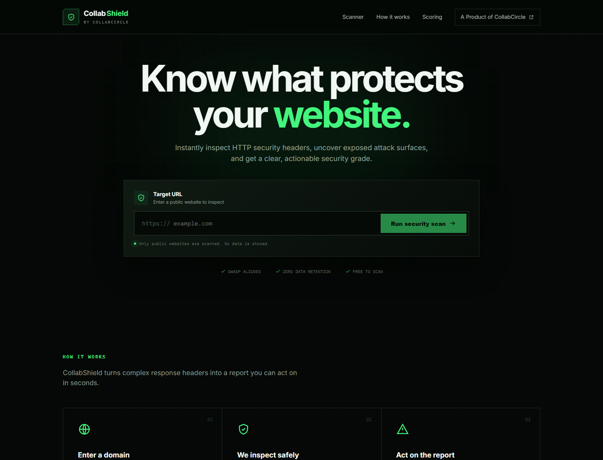
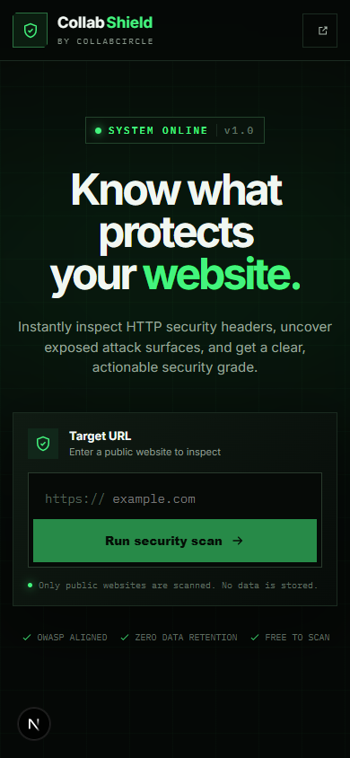
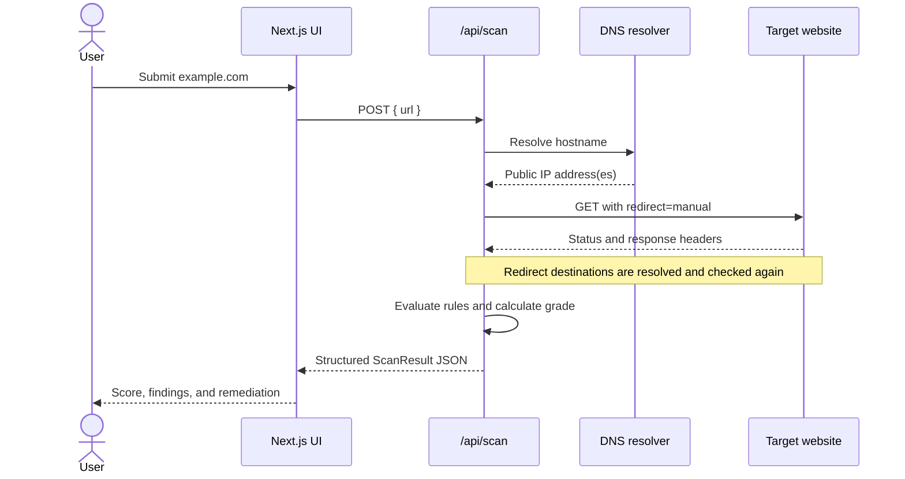

# CollabShield

> Know what protects your website.

CollabShield is a lightweight, browser-based HTTP Security Header & Threat Scanner from **CollabCircle**. Enter a public domain and receive a clear 0–100 security score, an A+–F grade, and an actionable breakdown of the HTTP response headers that help protect the site.

It is built with Next.js and deliberately requires no database. The browser submits a URL to a server-side API route, which safely requests the target and evaluates its response headers without exposing the browser to cross-origin restrictions.

## UI snapshots

> Screenshots are generated from the running application and stored in `public/screenshots/` during the release verification workflow.

| Desktop | Mobile |
| --- | --- |
|  |  |

## Features

- Public HTTP/HTTPS domain scanning through a Next.js serverless route
- Six OWASP-aligned security-header checks
- Context-aware CSP3 analysis for nonces, hashes, `strict-dynamic`, compatibility tokens, multiple policies, and defense-in-depth directives
- Confidence labels and evidence explaining every decision
- Report-only CSP, Trusted Types, CSP reporting, and redirect-chain visibility
- Downloadable JSON reports, clipboard summaries, and print-friendly output
- Best-effort API throttling with rate-limit response headers
- Weighted 0–100 score and A+ through F grade
- Severity labels, observed values, attack vectors, and remediation guidance
- Safe manual redirect handling with validation at every hop
- SSRF defenses against localhost, private, link-local, and reserved networks
- Ten-second request timeout and five-redirect ceiling
- Responsive black-and-green security console interface
- Accessible form feedback, semantic report controls, and reduced-motion support
- Smooth loading and report transitions
- No database and no scan-history retention
- Social links loaded from server-side environment variables
- Unit-tested score calculation and URL normalization

## Security headers evaluated

| Header | Weight | Primary risk addressed | Strong result |
| --- | ---: | --- | --- |
| `Content-Security-Policy` | 30 | XSS and content injection | Nonce/hash-based strict CSP with supporting defense-in-depth directives |
| `Strict-Transport-Security` | 20 | MitM interception and SSL stripping | Present with `max-age` of at least one year |
| Frame protection | 15 | Clickjacking | CSP `frame-ancestors`, or `X-Frame-Options` for legacy compatibility |
| `X-Content-Type-Options` | 15 | MIME confusion | `nosniff` |
| `Referrer-Policy` | 10 | URL and browsing-context leakage | Explicit privacy-preserving value; browser fallback is identified separately |
| `Permissions-Policy` | 10 | Unnecessary browser capability access | Common sensitive capabilities are explicitly restricted |

The weights total 100. Passing controls receive full credit. Warnings and partially effective controls receive a rule-specific proportion based on the protection observed. A missing optional defense may retain limited fallback credit when modern browsers provide a meaningful default; that state is clearly identified with its confidence level.

| Score | Grade |
| ---: | :---: |
| 95–100 | A+ |
| 85–94 | A |
| 75–84 | B |
| 65–74 | C |
| 50–64 | D |
| 0–49 | F |

CollabShield reports configuration signals; it does not prove that a target is secure and is not a replacement for a full security audit or penetration test. A failed check means that a header-level defense was not observed—not that an exploitable vulnerability has been confirmed.

## System flow

```mermaid
flowchart LR
    U[User enters a domain] --> C[Client validates input]
    C -->|POST /api/scan| A[Next.js API route]
    A --> N[Normalize URL]
    N --> D[Resolve DNS and reject private IPs]
    D --> F[Fetch with timeout and manual redirects]
    F -->|Each redirect| D
    F --> E[Evaluate six header rules]
    E --> S[Calculate score and grade]
    S -->|JSON| R[Interactive browser report]
```



### Request sequence



## Architecture

```text
CollabShield/
├── app/
│   ├── api/scan/route.ts       # Serverless scan endpoint
│   ├── globals.css             # Theme and responsive styles
│   ├── layout.tsx              # Metadata, fonts, root document
│   └── page.tsx                # Landing page composition
├── components/
│   ├── brand.tsx               # Shared CollabShield identity
│   ├── icons.tsx               # Lightweight inline SVG icons
│   ├── scan-report.tsx         # Interactive result breakdown
│   ├── scanner.tsx             # Client form and request state
│   ├── score-ring.tsx          # Grade visualization
│   ├── site-footer.tsx         # Environment-driven social links
│   └── site-header.tsx         # Responsive navigation
├── lib/
│   ├── scanner/
│   │   ├── rules.ts            # Header rules and weights
│   │   ├── scan.ts             # Safe target-fetch orchestration
│   │   ├── score.ts            # Evaluation and grade calculation
│   │   ├── types.ts            # Shared scanner contracts
│   │   └── url-security.ts     # URL normalization and SSRF checks
│   └── socials.ts              # Server-only environment mapping
├── public/screenshots/         # Documentation images
├── .env.example                # Safe environment template
├── next.config.ts
├── package.json
└── vitest.config.ts
```

The project uses a unified Next.js structure. The UI and serverless backend remain separated by module and runtime boundary without maintaining two independent applications.

## Local setup

### Requirements

- Node.js 20.9 or later
- npm 10 or later
- Internet access for target scans and Google-hosted font retrieval during the production build

### Installation

```bash
git clone https://github.com/CollabCircle-Official/CollabShield.git
cd CollabShield
npm install
```

Create the local environment file:

```bash
cp .env.example .env
```

On PowerShell:

```powershell
Copy-Item .env.example .env
```

Replace the example values with the full HTTPS URLs for CollabCircle, then start the development server:

```bash
npm run dev
```

Open [http://localhost:3000](http://localhost:3000).

## Environment variables

The names intentionally match CollabCircle's existing environment contract. These variables remain server-side; the application validates them and passes only safe HTTPS links to the header and footer.

| Variable | Purpose | Example |
| --- | --- | --- |
| `Website` | CollabCircle website | `https://collabcircle.example` |
| `Facebook` | Facebook page | `https://facebook.com/collabcircle` |
| `Instagram` | Instagram profile | `https://instagram.com/collabcircle` |
| `Linkedin` | LinkedIn company page | `https://linkedin.com/company/collabcircle` |
| `X` | X profile | `https://x.com/collabcircle` |
| `YouTube` | YouTube channel | `https://youtube.com/@collabcircle` |

Missing or invalid values are omitted from the interface. The `.env` file is excluded from Git; `.env.example` is safe to commit.

## API

### `POST /api/scan`

Request:

```json
{
  "url": "example.com"
}
```

Successful responses contain the normalized and final URLs, HTTP status, scan time, score, grade, and one structured result for each security rule.

```json
{
  "requestedUrl": "https://example.com/",
  "finalUrl": "https://example.com/",
  "statusCode": 200,
  "methodologyVersion": "2.0",
  "score": 35,
  "grade": "F",
  "passed": 2,
  "total": 6,
  "redirectChain": [{ "url": "https://example.com/", "statusCode": 200 }],
  "findings": []
}
```

Errors use a suitable HTTP status and `{ "error": "..." }`. Requests are not cached.

The route permits ten scans per client per minute per running application instance. It returns `429 Too Many Requests`, `Retry-After`, and `X-RateLimit-Remaining` when applicable. Because serverless instances are distributed and ephemeral, production deployments should add provider-level rate limiting for globally consistent enforcement.

## Security model

Fetching user-supplied URLs introduces Server-Side Request Forgery risk. CollabShield reduces this risk by:

1. Accepting only HTTP and HTTPS URLs without credentials or custom ports.
2. Resolving the hostname before connecting.
3. Rejecting any hostname that resolves to local, private, link-local, multicast, or reserved address space.
4. Disabling automatic redirects and re-running validation for every redirect destination.
5. Capping requests at five redirects and ten seconds.
6. Limiting the JSON request body and returning no target response body to the browser.

For a public deployment, add platform-level rate limiting, abuse monitoring, egress firewall rules, and DNS pinning protection appropriate to the hosting provider. Application-level DNS checks are an important layer but are not a complete substitute for network-level egress controls.

## Commands

| Command | Action |
| --- | --- |
| `npm run dev` | Start the local Next.js development server |
| `npm run build` | Create an optimized production build |
| `npm start` | Serve the production build |
| `npm run lint` | Run ESLint and Next.js rules |
| `npm test` | Run the Vitest suite once |
| `npm run test:watch` | Run tests in watch mode |

## Deployment

The project can be deployed to Vercel or another Node.js platform supporting Next.js server routes.

1. Import the repository into the hosting platform.
2. Add all six social environment variables.
3. Ensure the runtime permits outbound DNS and HTTP/HTTPS requests.
4. Run `npm run build` as the build command.
5. Add rate limits and platform egress restrictions before advertising a public scanning service.

Static-only hosting is not supported because `/api/scan` requires a server runtime.

## Extending the scanner

Add a new rule to `lib/scanner/rules.ts`, update the weights so the total remains 100, and add scoring tests. Presentation consumes the shared `HeaderFinding` contract, so a standard rule requires no report-component changes.

## Privacy and responsible use

CollabShield does not intentionally retain submitted URLs or scan results. Hosting-provider request logs may still record metadata, so review provider logging settings before deployment. Only scan systems you are authorized to assess, respect target terms and rate limits, and do not treat the report as certification.

## License

Released under the [MIT License](LICENSE).

---

CollabShield is a product of **CollabCircle**.
